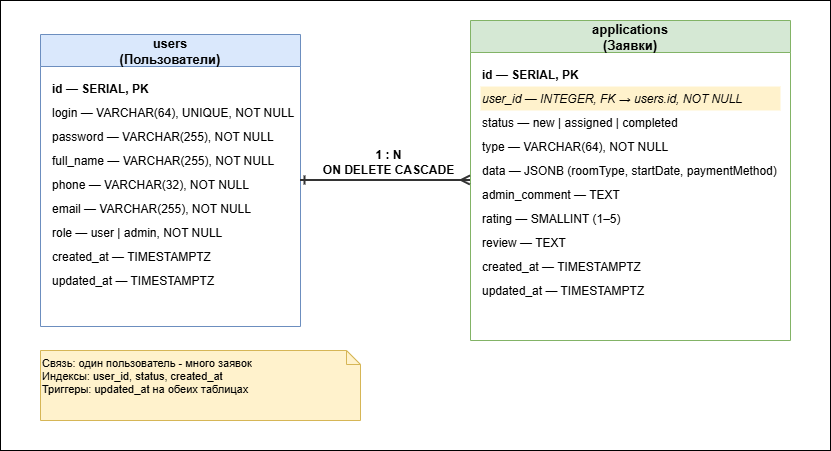

# Банкетам.Нет + Код безопасности

**Студент:** Князев Иван Игоревич  
**Экзамен:** В4_КОД 09.02.07-3-2026-ПУ, вариант 4  
**Репозиторий:** https://github.com/1inside1/banketam-net-exam

---

## Структура проекта

```
├── moduli-1-3-osnovnaya-chast/   Банкетам.Нет (React + Express + PostgreSQL)
├── modul-4-variativnaya-chast/   Код безопасности (HTML + CSS, 430×932)
└── README.md
```

---

## Модули 1–3 — Банкетам.Нет

Веб-портал бронирования банкетных помещений: зал, ресторан, летняя и закрытая веранда.

| Часть | Технологии |
|-------|------------|
| Frontend | React 18, Vite, Tailwind CSS, React Router |
| Backend | Node.js, Express |
| БД | PostgreSQL, Sequelize |
| Авторизация | JWT, bcrypt |

### Запуск

```bash
npm run install:all
npm run dev
```

- Сайт: http://localhost:3000  
- API: http://localhost:5000  
- Админ: **Admin26** / **Demo20**

### База данных



- `moduli-1-3-osnovnaya-chast/database/init.sql` — SQL-схема
- `moduli-1-3-osnovnaya-chast/database/er-diagram.drawio` — ER-диаграмма

---

## Модуль 4 — Код безопасности

Прототип мобильного приложения **430×932 px**, 2 экрана, HTML + CSS.

| Файл | Экран |
|------|-------|
| `modul-4-variativnaya-chast/index.html` | Главная — статистика, кнопка «Каталог» |
| `modul-4-variativnaya-chast/products.html` | Каталог продуктов — поиск, список |

Переходы: **Главная ↔ Продукты** (кнопка и нижнее меню).

### Просмотр

Открой в браузере:

```
modul-4-variativnaya-chast/index.html
```

Ассеты из папки `Медиа` задания — в `modul-4-variativnaya-chast/media/`.

---

## Git

Коммиты по этапам: модули 1–3 (по 3 коммита), ER-диаграмма, модуль 4.
